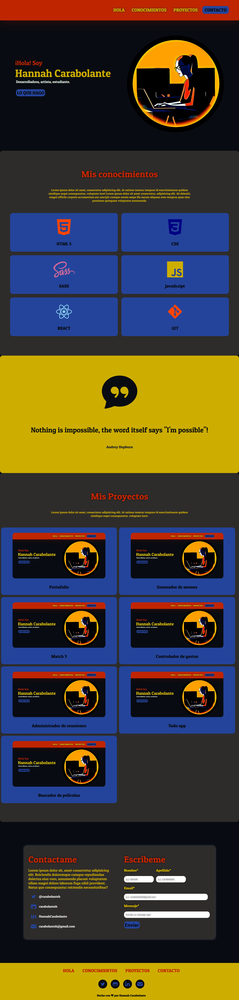

## Portafolio de Hannah Carabolante

#### Este proyecto esta realizado para mostrar como sería un portafolio para la entrega final del modulo-01 de Ada.

<br>


***

### Si quieres ver como me quedo puedes darle click a este [enlace](https://carabolanteh.github.io/portafolio/) o puedes hacerlo desde [acá](https://trusting-johnson-ac35a4.netlify.app).

<br>


***

### Si quieres tener el código en tu computadora, deberás de seguir estos pasos en tu terminal.

- Ir al [repositorio](https://github.com/carabolanteh/portafolio).
- Darle click al botón de forkear.
- Darle click al botón de code color verde.
- Copiar la url.
- Abrir tu terminal y poner el comando de  ```git clone <url>```.
- Entrar a la carpeta del proyecto y abrirlo en tu IDE.

### Este proyecto no necesita la instalación de ningua dependencia, por ahora!

<br>

***

### A continuación dejo una imagen ilustrativa de como se debería ver el portafolio en tu navegador.

<br>
<br>




<br>

***

<br>

### Este portafolio fue desarrollado para el primer proyecto de la 6ta generación de ADA.

<br>

***

#### De Hannah, con mucho 🖤 para ustedes!